# ZARC architecture diagrams

[Back to architecture index](../00-README.md)

These diagrams render on GitHub. Each original Mermaid source remains available for editing.

## D01 — Vehicle system context

[Editable Mermaid source](D01.mmd)

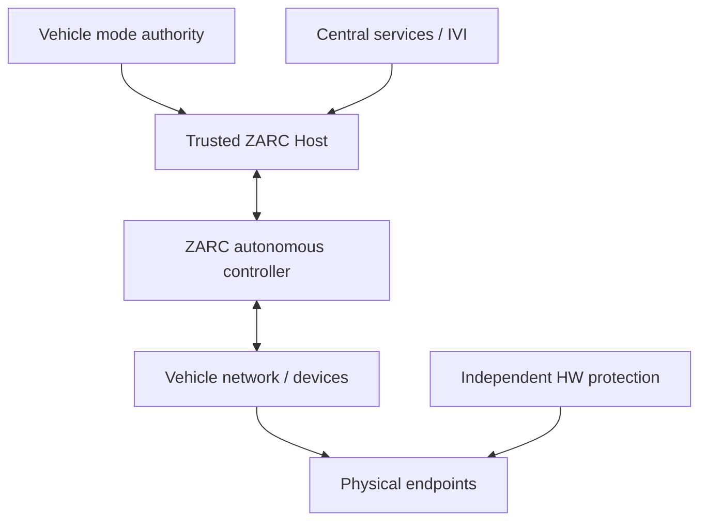
```mermaid
flowchart TD
  %% Vehicle system context
  N0_0["Vehicle mode authority"]
  N0_1["Central services / IVI"]
  N1_0["Trusted ZARC Host"]
  N2_0["ZARC autonomous controller"]
  N3_0["Vehicle network / devices"]
  N3_1["Independent HW protection"]
  N4_0["Physical endpoints"]
  N0_0 --> N1_0
  N0_1 --> N1_0
  N1_0 <--> N2_0
  N2_0 <--> N3_0
  N3_0 --> N4_0
  N3_1 --> N4_0
  %% Host supplies desired intent and receives observation; local controller owns allocated physical outcomes.
```

## D02 — Allowed build and import dependencies

[Editable Mermaid source](D02.mmd)

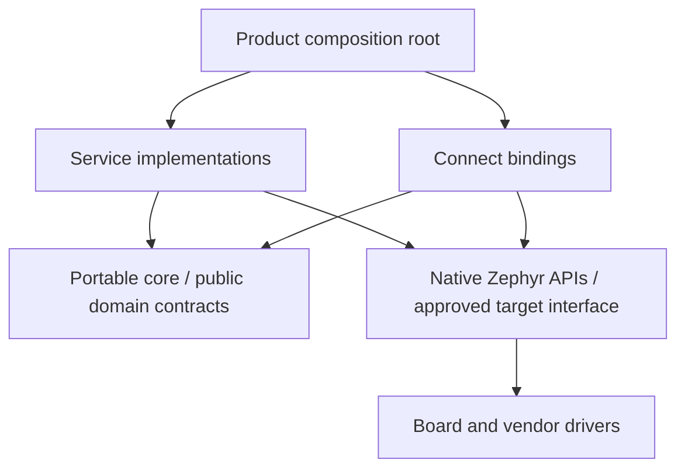
```mermaid
flowchart TD
  %% Allowed build and import dependencies
  N0_0["Product composition root"]
  N1_0["Service implementations"]
  N1_1["Connect bindings"]
  N2_0["Portable core / public domain contracts"]
  N3_0["Native Zephyr APIs / approved target interface"]
  N4_0["Board and vendor drivers"]
  N0_0 --> N1_0
  N0_0 --> N1_1
  N1_0 --> N2_0
  N1_1 --> N2_0
  N1_0 --> N3_0
  N1_1 --> N3_0
  N3_0 --> N4_0
  %% Core does not import services, products or vendor private headers. Host imports external schema only.
```

## D03 — Native runtime and work ownership

[Editable Mermaid source](D03.mmd)

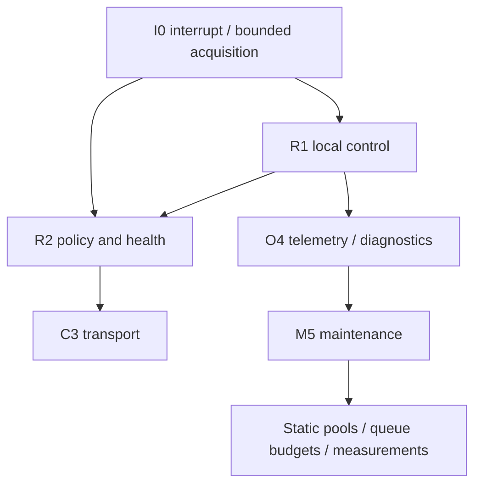
```mermaid
flowchart TD
  %% Native runtime and work ownership
  N0_0["I0 interrupt / bounded acquisition"]
  N1_0["R1 local control"]
  N1_1["R2 policy and health"]
  N2_0["C3 transport"]
  N2_1["O4 telemetry / diagnostics"]
  N3_0["M5 maintenance"]
  N4_0["Static pools / queue budgets / measurements"]
  N0_0 --> N1_0
  N0_0 --> N1_1
  N1_0 --> N1_1
  N1_1 --> N2_0
  N1_0 --> N2_1
  N2_1 --> N3_0
  N3_0 --> N4_0
  %% Arrows show information flow. R1 does not wait for C3/O4/M5. Separate actual task priorities per target.
```

## D04 — Smart edge profile

[Editable Mermaid source](D04.mmd)

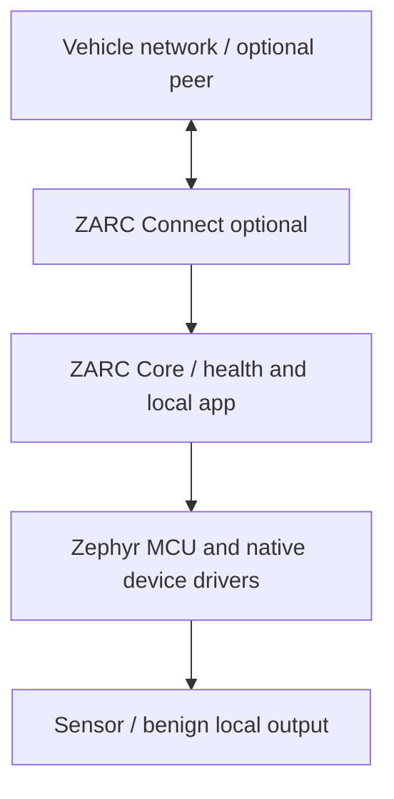
```mermaid
flowchart TD
  %% Smart edge profile
  N0_0["Vehicle network / optional peer"]
  N1_0["ZARC Connect optional"]
  N2_0["ZARC Core / health and local app"]
  N3_0["Zephyr MCU and native device drivers"]
  N4_0["Sensor / benign local output"]
  N0_0 <--> N1_0
  N1_0 --> N2_0
  N2_0 --> N3_0
  N3_0 --> N4_0
  %% Compile only required capability set; local behavior must survive upstream outage.
```

## D05 — Companion controller profile

[Editable Mermaid source](D05.mmd)

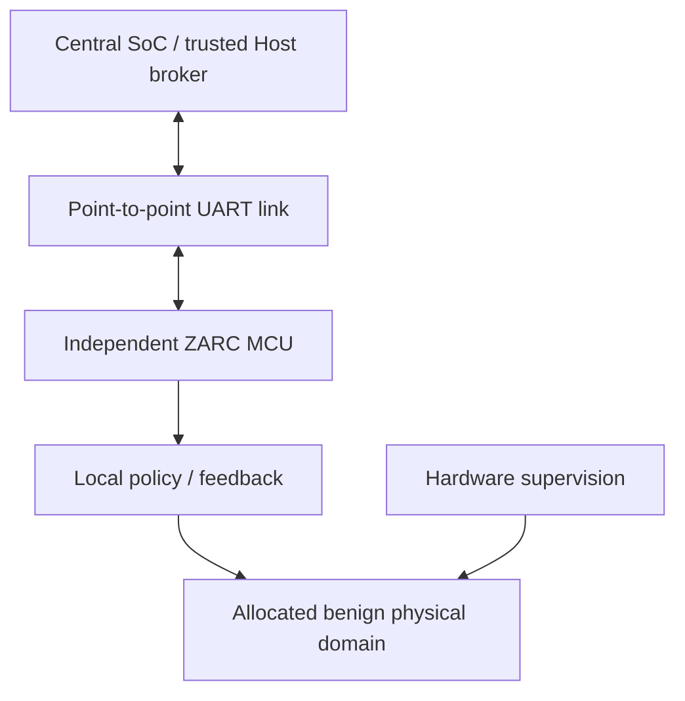
```mermaid
flowchart TD
  %% Companion controller profile
  N0_0["Central SoC / trusted Host broker"]
  N1_0["Point-to-point UART link"]
  N2_0["Independent ZARC MCU"]
  N3_0["Local policy / feedback"]
  N3_1["Hardware supervision"]
  N4_0["Allocated benign physical domain"]
  N0_0 <--> N1_0
  N1_0 <--> N2_0
  N2_0 --> N3_0
  N3_0 --> N4_0
  N3_1 --> N4_0
  %% Independent startup/reset and electrical behavior require board-specific allocation and HIL.
```

## D06 — Zonal controller profile

[Editable Mermaid source](D06.mmd)

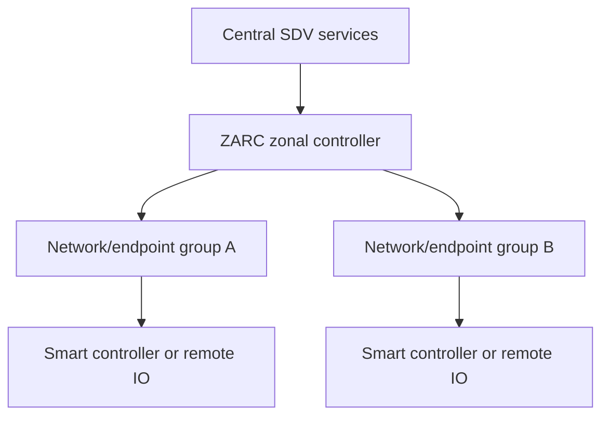
```mermaid
flowchart TD
  %% Zonal controller profile
  N0_0["Central SDV services"]
  N1_0["ZARC zonal controller"]
  N2_0["Network/endpoint group A"]
  N2_1["Network/endpoint group B"]
  N3_0["Smart controller or remote IO"]
  N3_1["Smart controller or remote IO"]
  N0_0 --> N1_0
  N1_0 --> N2_0
  N1_0 --> N2_1
  N2_0 --> N3_0
  N2_1 --> N3_1
  %% Endpoint fault domains and local protection are part of the vehicle integration.
```

## D07 — Integrated real-time core profile

[Editable Mermaid source](D07.mmd)

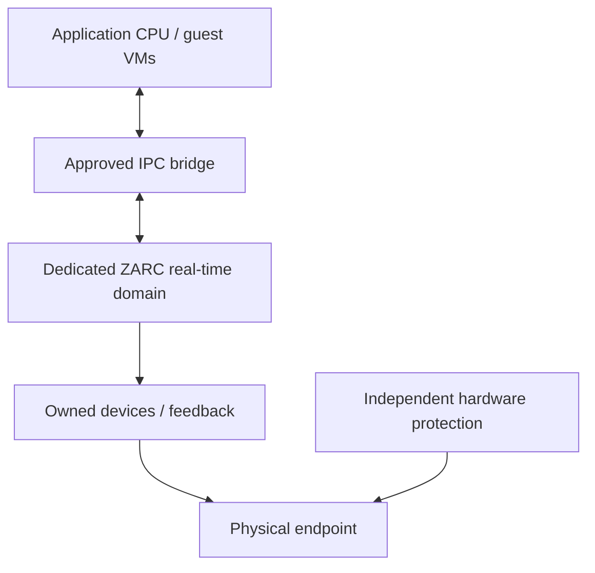
```mermaid
flowchart TD
  %% Integrated real-time core profile
  N0_0["Application CPU / guest VMs"]
  N1_0["Approved IPC bridge"]
  N2_0["Dedicated ZARC real-time domain"]
  N3_0["Owned devices / feedback"]
  N3_1["Independent hardware protection"]
  N4_0["Physical endpoint"]
  N0_0 <--> N1_0
  N1_0 <--> N2_0
  N2_0 --> N3_0
  N3_0 --> N4_0
  N3_1 --> N4_0
  %% Shared resource, reset, clock, memory and DMA boundaries require evidence; external MCU fallback.
```

## D08 — Product line composition

[Editable Mermaid source](D08.mmd)

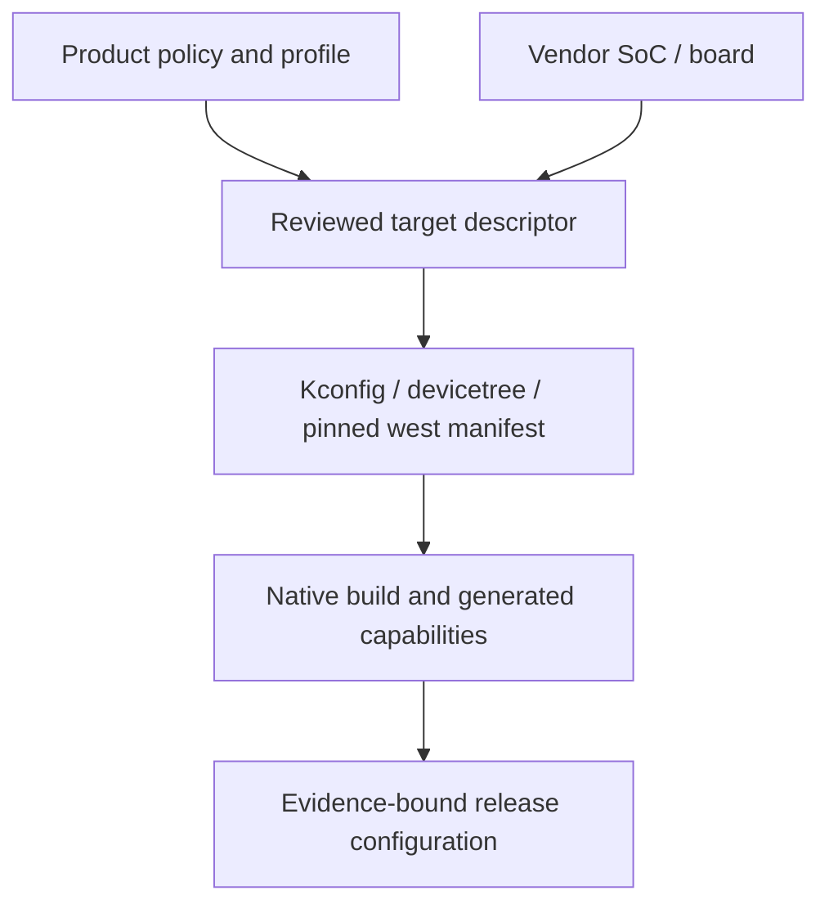
```mermaid
flowchart TD
  %% Product line composition
  N0_0["Product policy and profile"]
  N0_1["Vendor SoC / board"]
  N1_0["Reviewed target descriptor"]
  N2_0["Kconfig / devicetree / pinned west manifest"]
  N3_0["Native build and generated capabilities"]
  N4_0["Evidence-bound release configuration"]
  N0_0 --> N1_0
  N0_1 --> N1_0
  N1_0 --> N2_0
  N2_0 --> N3_0
  N3_0 --> N4_0
  %% The target composes product and board; immutable generated descriptor binds evidence.
```

## D09 — Service lifecycle and distinct restart paths

[Editable Mermaid source](D09.mmd)

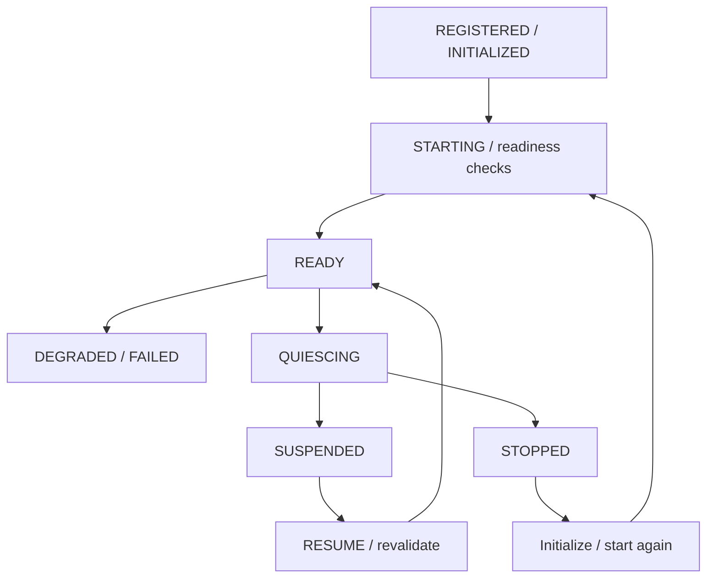
```mermaid
flowchart TD
  %% Service lifecycle and distinct restart paths
  N0_0["REGISTERED / INITIALIZED"]
  N1_0["STARTING / readiness checks"]
  N2_0["READY"]
  N2_1["DEGRADED / FAILED"]
  N3_0["QUIESCING"]
  N4_0["SUSPENDED"]
  N4_1["STOPPED"]
  N5_0["RESUME / revalidate"]
  N5_1["Initialize / start again"]
  N0_0 --> N1_0
  N1_0 --> N2_0
  N2_0 --> N2_1
  N2_0 --> N3_0
  N3_0 --> N4_0
  N3_0 --> N4_1
  N4_0 --> N5_0
  N4_1 --> N5_1
  N5_0 --> N2_0
  N5_1 --> N1_0
  %% Both return to READY only after checks; fully stopped service must initialize/start again.
```

## D10 — Typed intent and observed outcome

[Editable Mermaid source](D10.mmd)

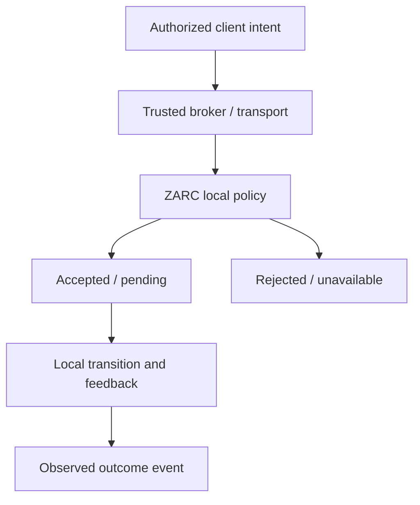
```mermaid
flowchart TD
  %% Typed intent and observed outcome
  N0_0["Authorized client intent"]
  N1_0["Trusted broker / transport"]
  N2_0["ZARC local policy"]
  N3_0["Accepted / pending"]
  N3_1["Rejected / unavailable"]
  N4_0["Local transition and feedback"]
  N5_0["Observed outcome event"]
  N0_0 --> N1_0
  N1_0 --> N2_0
  N2_0 --> N3_0
  N2_0 --> N3_1
  N3_0 --> N4_0
  N4_0 --> N5_0
  %% ACCEPTED does not equal COMPLETED. Refusal/timeout does not fabricate physical state.
```

## D11 — Session reset and reconciliation

[Editable Mermaid source](D11.mmd)

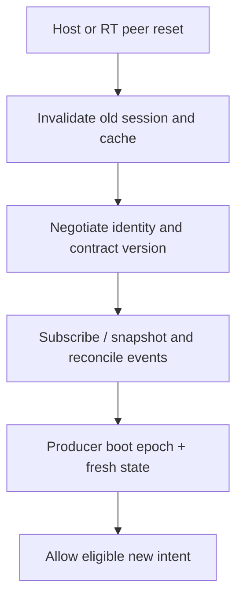
```mermaid
flowchart TD
  %% Session reset and reconciliation
  N0_0["Host or RT peer reset"]
  N1_0["Invalidate old session and cache"]
  N2_0["Negotiate identity and contract version"]
  N3_0["Subscribe / snapshot and reconcile events"]
  N4_0["Producer boot epoch + fresh state"]
  N5_0["Allow eligible new intent"]
  N0_0 --> N1_0
  N1_0 --> N2_0
  N2_0 --> N3_0
  N3_0 --> N4_0
  N4_0 --> N5_0
  %% A new link session need not mean controller boot changed. Detect event gaps and do not replay stale intents.
```

## D12 — Transport provider model

[Editable Mermaid source](D12.mmd)

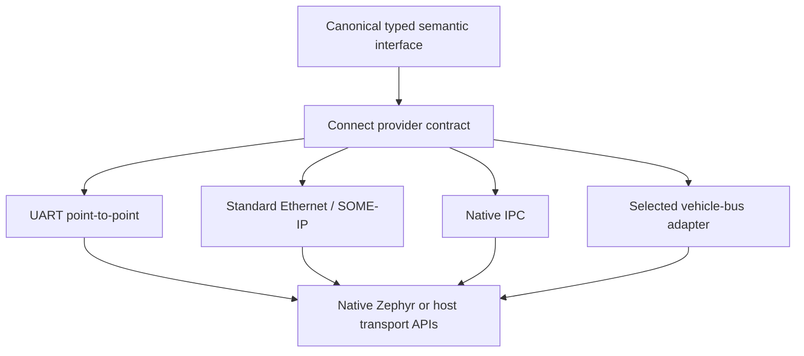
```mermaid
flowchart TD
  %% Transport provider model
  N0_0["Canonical typed semantic interface"]
  N1_0["Connect provider contract"]
  N2_0["UART point-to-point"]
  N2_1["Standard Ethernet / SOME-IP"]
  N3_0["Native IPC"]
  N3_1["Selected vehicle-bus adapter"]
  N4_0["Native Zephyr or host transport APIs"]
  N0_0 --> N1_0
  N1_0 --> N2_0
  N1_0 --> N2_1
  N1_0 --> N3_0
  N1_0 --> N3_1
  N2_0 --> N4_0
  N2_1 --> N4_0
  N3_0 --> N4_0
  N3_1 --> N4_0
  %% Independent bindings; not a universal wire protocol. Each transport declares verified capabilities.
```

## D13 — Central compute and hypervisor

[Editable Mermaid source](D13.mmd)

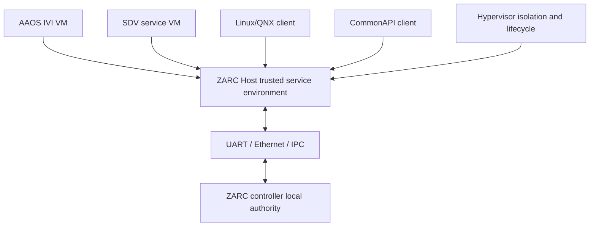
```mermaid
flowchart TD
  %% Central compute and hypervisor
  N0_0["AAOS IVI VM"]
  N0_1["SDV service VM"]
  N1_0["Linux/QNX client"]
  N1_1["CommonAPI client"]
  N2_0["Hypervisor isolation and lifecycle"]
  N3_0["ZARC Host trusted service environment"]
  N4_0["UART / Ethernet / IPC"]
  N5_0["ZARC controller local authority"]
  N0_0 --> N3_0
  N0_1 --> N3_0
  N1_0 --> N3_0
  N1_1 --> N3_0
  N2_0 --> N3_0
  N3_0 <--> N4_0
  N4_0 <--> N5_0
  %% The trusted service environment alone owns the physical endpoint; VM topology is deployment-specific.
```

## D14 — Android VHAL and SDV mappings

[Editable Mermaid source](D14.mmd)

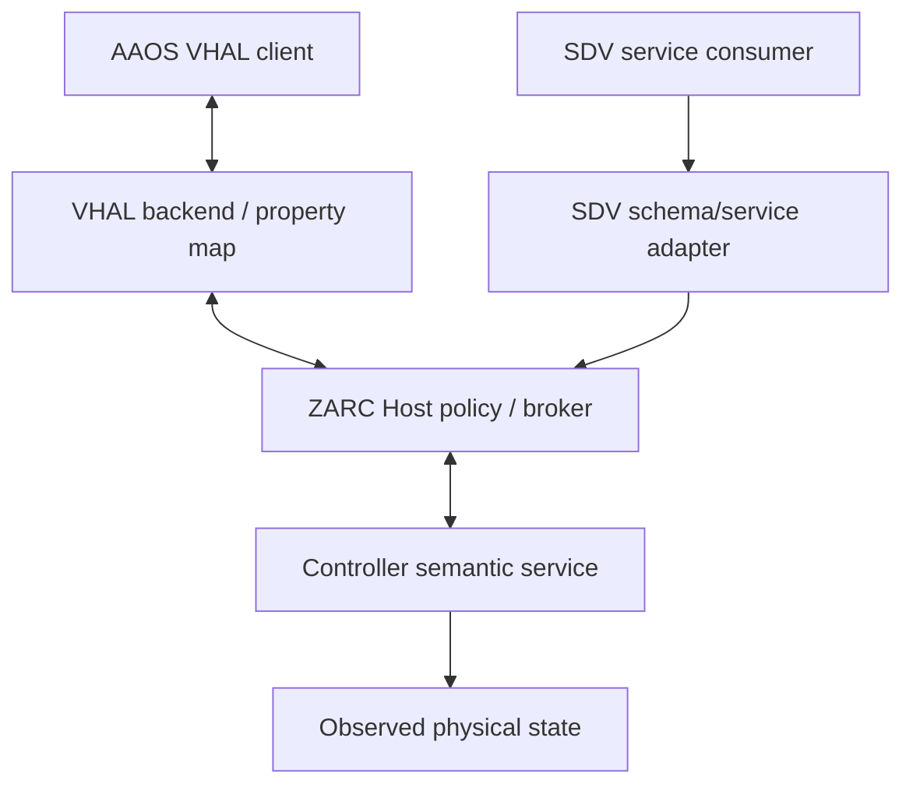
```mermaid
flowchart TD
  %% Android VHAL and SDV mappings
  N0_0["AAOS VHAL client"]
  N0_1["SDV service consumer"]
  N1_0["VHAL backend / property map"]
  N1_1["SDV schema/service adapter"]
  N2_0["ZARC Host policy / broker"]
  N3_0["Controller semantic service"]
  N4_0["Observed physical state"]
  N0_0 <--> N1_0
  N0_1 --> N1_1
  N1_0 <--> N2_0
  N1_1 --> N2_0
  N2_0 <--> N3_0
  N3_0 --> N4_0
  %% VMCU to Android: AP_POWER_STATE_REQ. Android to VMCU: AP_POWER_STATE_REPORT. Physical authority remains local.
```

## D15 — Coordinated shutdown and readiness

[Editable Mermaid source](D15.mmd)

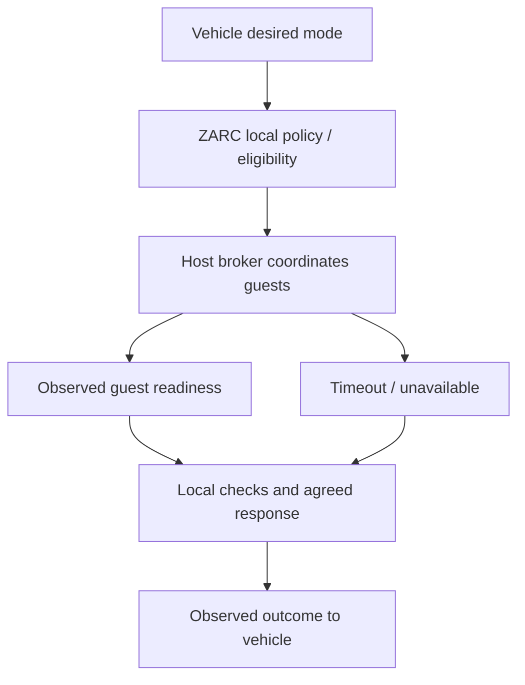
```mermaid
flowchart TD
  %% Coordinated shutdown and readiness
  N0_0["Vehicle desired mode"]
  N1_0["ZARC local policy / eligibility"]
  N2_0["Host broker coordinates guests"]
  N3_0["Observed guest readiness"]
  N3_1["Timeout / unavailable"]
  N4_0["Local checks and agreed response"]
  N5_0["Observed outcome to vehicle"]
  N0_0 --> N1_0
  N1_0 --> N2_0
  N2_0 --> N3_0
  N2_0 --> N3_1
  N3_0 --> N4_0
  N3_1 --> N4_0
  N4_0 --> N5_0
  %% Timeout response allocated by OEM. Guest readiness is not electrical state.
```

## D16 — Safety evidence allocation

[Editable Mermaid source](D16.mmd)

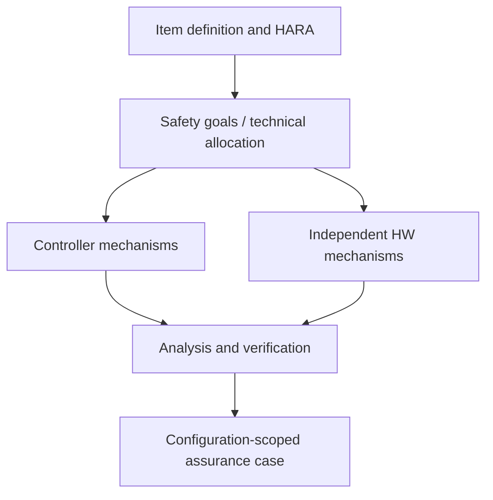
```mermaid
flowchart TD
  %% Safety evidence allocation
  N0_0["Item definition and HARA"]
  N1_0["Safety goals / technical allocation"]
  N2_0["Controller mechanisms"]
  N2_1["Independent HW mechanisms"]
  N3_0["Analysis and verification"]
  N4_0["Configuration-scoped assurance case"]
  N0_0 --> N1_0
  N1_0 --> N2_0
  N1_0 --> N2_1
  N2_0 --> N3_0
  N2_1 --> N3_0
  N3_0 --> N4_0
  %% No safety rating until exact allocations and evidence are accepted.
```

## D17 — Security trust boundaries

[Editable Mermaid source](D17.mmd)

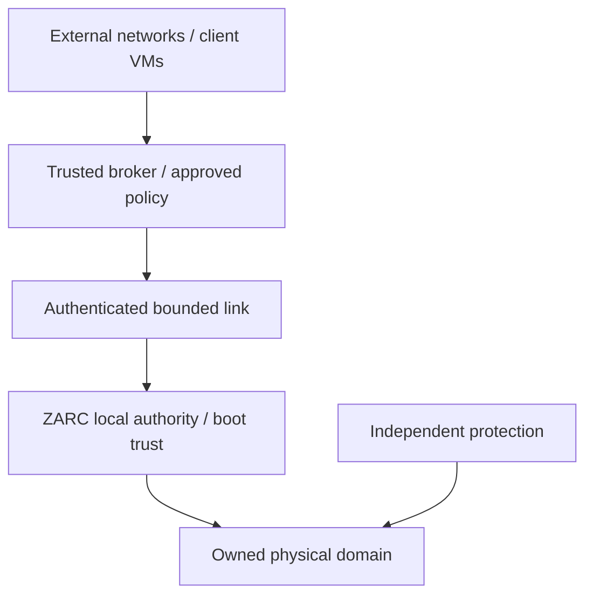
```mermaid
flowchart TD
  %% Security trust boundaries
  N0_0["External networks / client VMs"]
  N1_0["Trusted broker / approved policy"]
  N2_0["Authenticated bounded link"]
  N3_0["ZARC local authority / boot trust"]
  N4_0["Owned physical domain"]
  N4_1["Independent protection"]
  N0_0 --> N1_0
  N1_0 --> N2_0
  N2_0 --> N3_0
  N3_0 --> N4_0
  N4_1 --> N4_0
  %% Engineering and update trust chains are separately controlled; authentication is not a safety mechanism.
```

## D18 — Update and recovery flow

[Editable Mermaid source](D18.mmd)

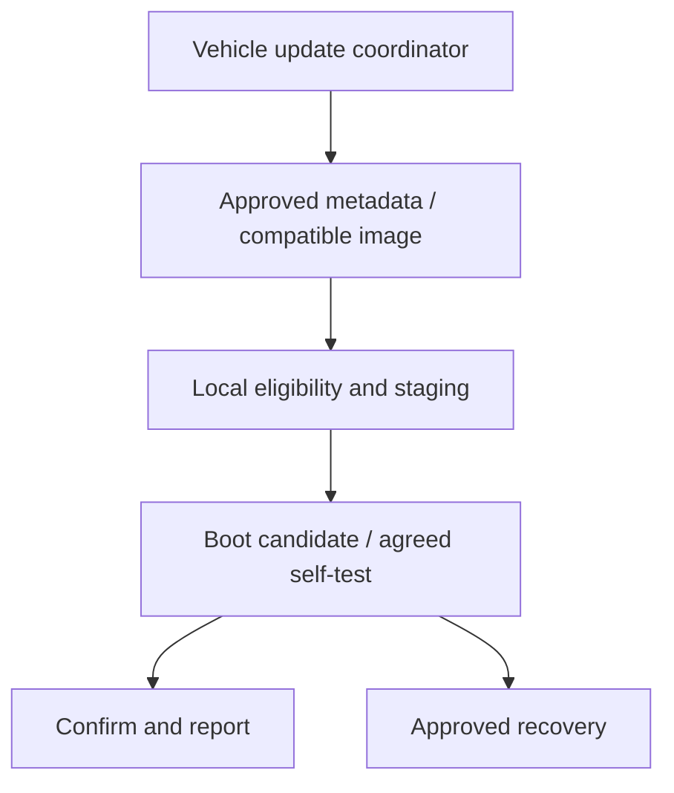
```mermaid
flowchart TD
  %% Update and recovery flow
  N0_0["Vehicle update coordinator"]
  N1_0["Approved metadata / compatible image"]
  N2_0["Local eligibility and staging"]
  N3_0["Boot candidate / agreed self-test"]
  N4_0["Confirm and report"]
  N4_1["Approved recovery"]
  N0_0 --> N1_0
  N1_0 --> N2_0
  N2_0 --> N3_0
  N3_0 --> N4_0
  N3_0 --> N4_1
  %% Exact recovery and rollback depend on selected flash/boot and integrator policy.
```

## D19 — Verification and evidence progression

[Editable Mermaid source](D19.mmd)

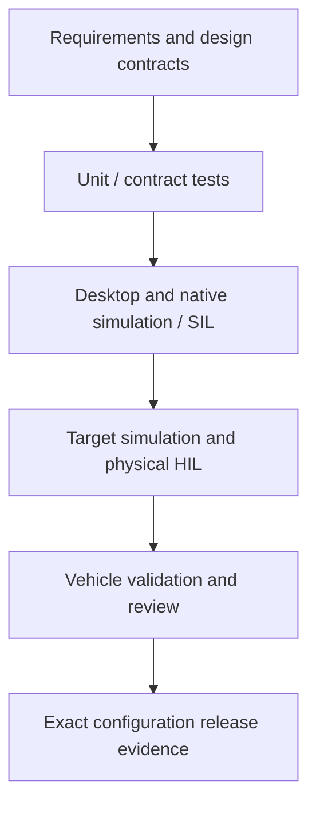
```mermaid
flowchart TD
  %% Verification and evidence progression
  N0_0["Requirements and design contracts"]
  N1_0["Unit / contract tests"]
  N2_0["Desktop and native simulation / SIL"]
  N3_0["Target simulation and physical HIL"]
  N4_0["Vehicle validation and review"]
  N5_0["Exact configuration release evidence"]
  N0_0 --> N1_0
  N1_0 --> N2_0
  N2_0 --> N3_0
  N3_0 --> N4_0
  N4_0 --> N5_0
  %% Simulation does not replace physical evidence. Unverified scope cannot pass release gate.
```

## D20 — Supplier contribution ecosystem

[Editable Mermaid source](D20.mmd)

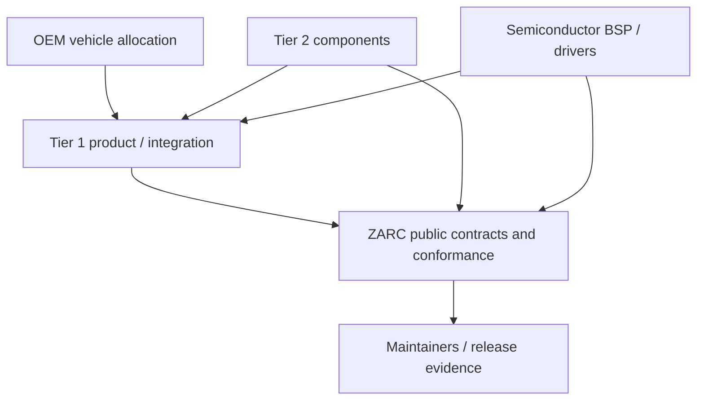
```mermaid
flowchart TD
  %% Supplier contribution ecosystem
  N0_0["OEM vehicle allocation"]
  N1_0["Tier 1 product / integration"]
  N2_0["Tier 2 components"]
  N2_1["Semiconductor BSP / drivers"]
  N3_0["ZARC public contracts and conformance"]
  N4_0["Maintainers / release evidence"]
  N0_0 --> N1_0
  N2_0 --> N1_0
  N2_1 --> N1_0
  N1_0 --> N3_0
  N2_0 --> N3_0
  N2_1 --> N3_0
  N3_0 --> N4_0
  %% Supplier roles own separate deliverables; interfaces and evidence reviewed independently.
```

## D21

[Editable Mermaid source](D21.mmd)

```mermaid
sequenceDiagram
  participant C as Authorized client
  participant H as Trusted Host
  participant R as ZARC controller
  participant F as Simulated device and feedback
  C->>H: Typed intent and request ID
  H->>R: Authorized intent
  alt eligible and permitted
    R-->>H: ACCEPTED (not completed)
    H-->>C: ACCEPTED
    R->>F: Approved local transition
    F-->>R: Observed result
    R-->>H: Observed state and quality
    H-->>C: Outcome
  else refused
    R-->>H: REJECTED
    H-->>C: Refusal
  end
  Note over C,R: Timeout means unknown outcome; reconcile snapshot
```

## D22

[Editable Mermaid source](D22.mmd)

```mermaid
sequenceDiagram
  participant V as Vehicle mode authority
  participant R as ZARC controller
  participant H as Trusted Host
  participant G as Hypervisor and guests
  V->>R: Desired shutdown
  R->>H: Approved quiesce and deadline
  H->>G: Coordinate services and VMs
  alt required readiness confirmed
    G-->>H: Actual readiness
    H-->>R: Aggregated status
    R->>R: Recheck allocated local conditions
    R-->>V: Observed result
  else timeout or unready
    H-->>R: Readiness unavailable
    R-->>V: Approved degraded or fault response
  end
```
