# ZARC 2035 — Diagram atlas

[Architecture index](../00-README.md). All diagrams describe the intended design, not verified production topology. Arrows represent logical dependencies or information; authority, timing and evidence follow Z12.

## D01 — System context

[Editable Mermaid source](D01.mmd)

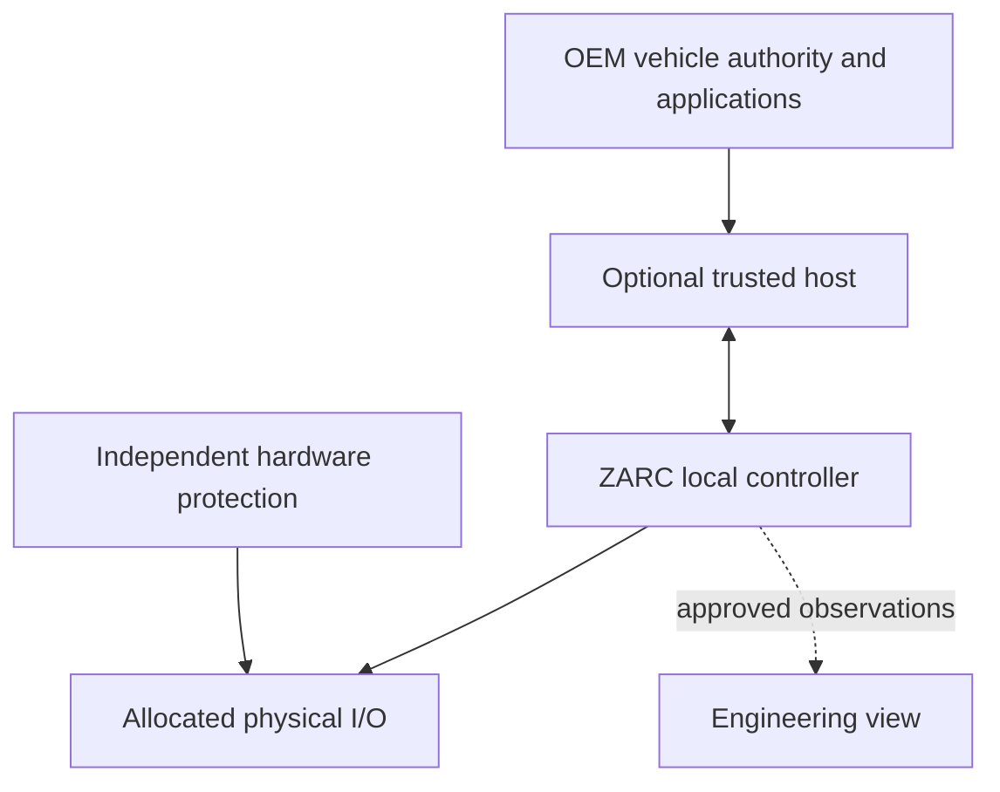
```mermaid
flowchart TD
  O[OEM vehicle authority and applications] --> H[Optional trusted host]
  H <--> C[ZARC local controller]
  C --> I[Allocated physical I/O]
  P[Independent hardware protection] --> I
  C -. approved observations .-> V[Engineering view]
```

## D02 — Build dependency direction

[Editable Mermaid source](D02.mmd)

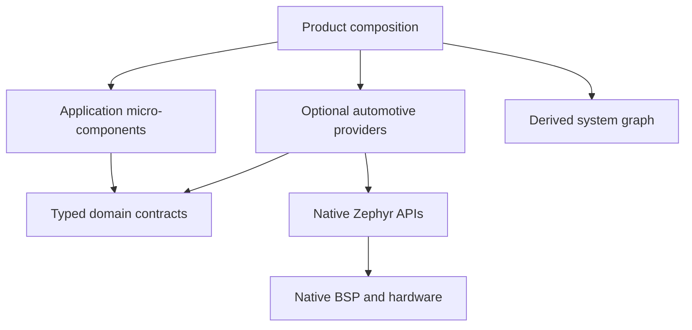
```mermaid
flowchart TD
  P[Product composition] --> A[Application micro-components]
  P --> S[Optional automotive providers]
  A --> K[Typed domain contracts]
  S --> K
  S --> Z[Native Zephyr APIs]
  Z --> B[Native BSP and hardware]
  P --> G[Derived system graph]
```

## D03 — Bounded native execution

[Editable Mermaid source](D03.mmd)

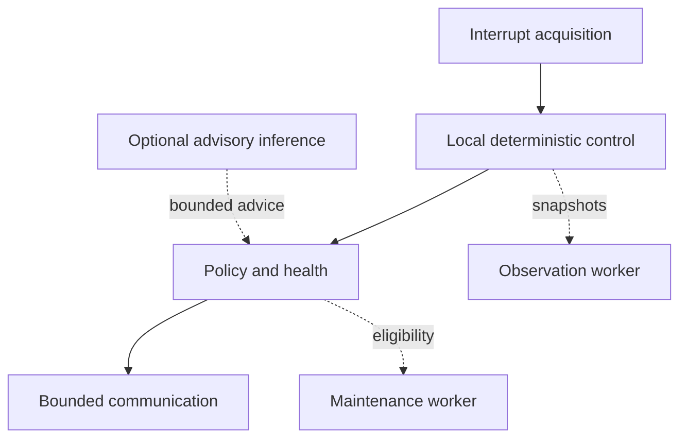
```mermaid
flowchart TD
  I[Interrupt acquisition] --> R[Local deterministic control]
  R --> H[Policy and health]
  H --> C[Bounded communication]
  R -. snapshots .-> O[Observation worker]
  H -. eligibility .-> M[Maintenance worker]
  AI[Optional advisory inference] -. bounded advice .-> H
```

## D04 — Standalone intelligent edge

[Editable Mermaid source](D04.mmd)

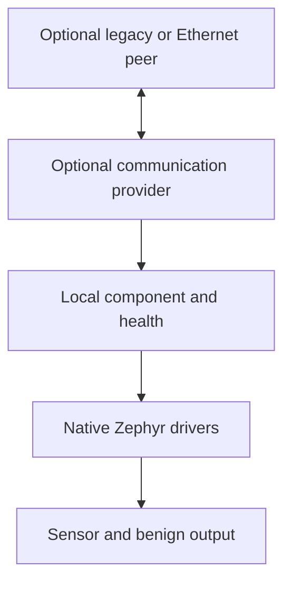
```mermaid
flowchart TD
  N[Optional legacy or Ethernet peer] <--> C[Optional communication provider]
  C --> A[Local component and health]
  A --> Z[Native Zephyr drivers]
  Z --> I[Sensor and benign output]
```

## D05 — Companion profile

[Editable Mermaid source](D05.mmd)

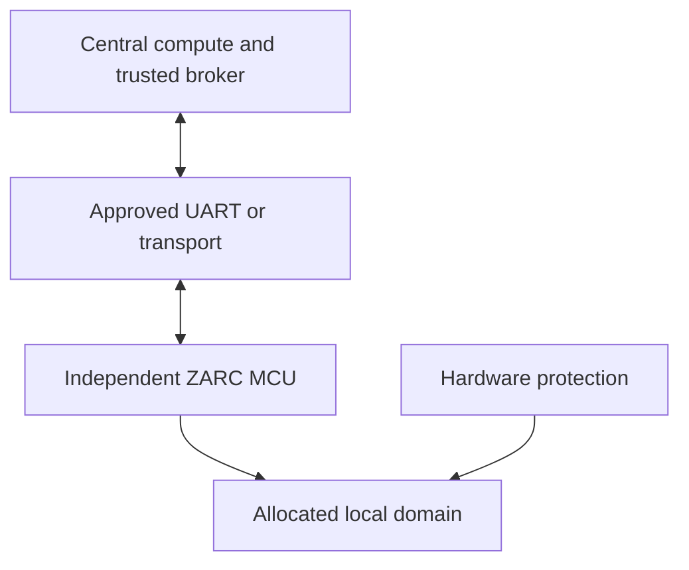
```mermaid
flowchart TD
  H[Central compute and trusted broker] <--> L[Approved UART or transport]
  L <--> C[Independent ZARC MCU]
  C --> I[Allocated local domain]
  P[Hardware protection] --> I
```

## D06 — Zone profile

[Editable Mermaid source](D06.mmd)

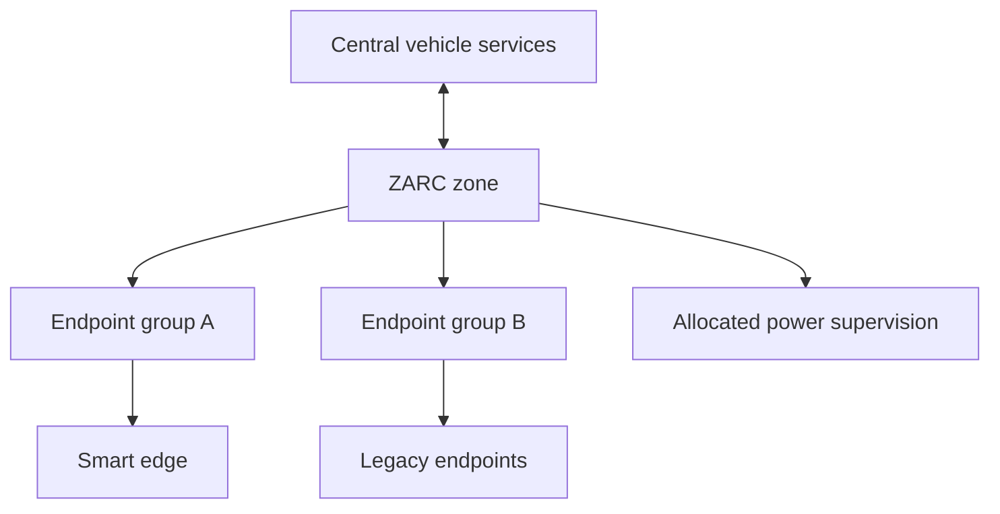
```mermaid
flowchart TD
  H[Central vehicle services] <--> Z[ZARC zone]
  Z --> A[Endpoint group A]
  Z --> B[Endpoint group B]
  Z --> P[Allocated power supervision]
  A --> I[Smart edge]
  B --> J[Legacy endpoints]
```

## D07 — Integrated real-time island

[Editable Mermaid source](D07.mmd)

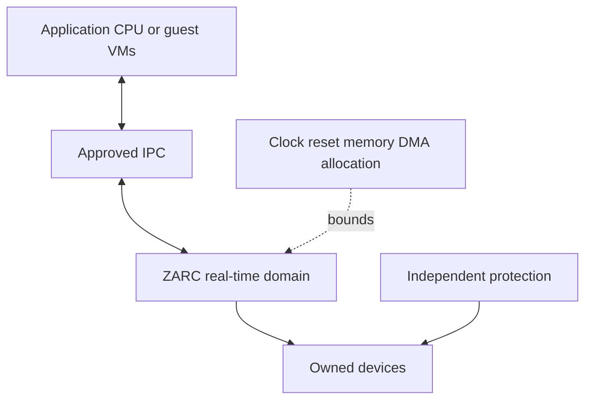
```mermaid
flowchart TD
  H[Application CPU or guest VMs] <--> I[Approved IPC]
  I <--> R[ZARC real-time domain]
  R --> D[Owned devices]
  P[Independent protection] --> D
  B[Clock reset memory DMA allocation] -. bounds .-> R
```

## D08 — Native product composition

[Editable Mermaid source](D08.mmd)

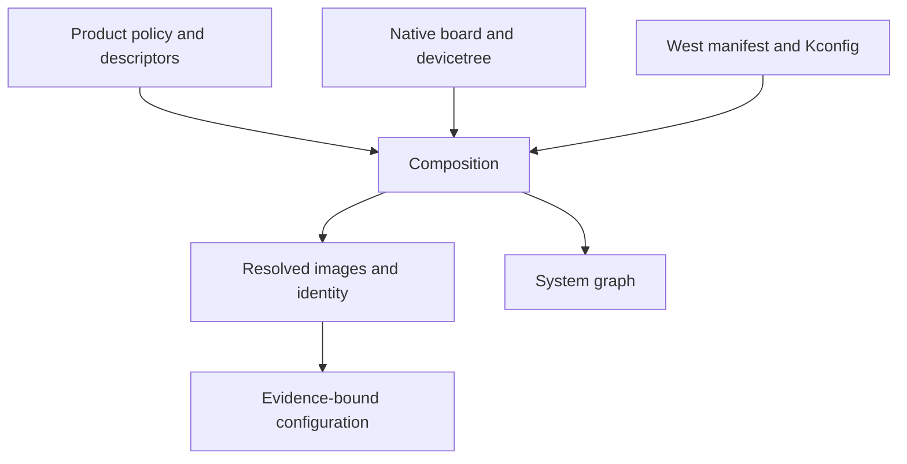
```mermaid
flowchart TD
  P[Product policy and descriptors] --> C[Composition]
  B[Native board and devicetree] --> C
  W[West manifest and Kconfig] --> C
  C --> I[Resolved images and identity]
  C --> G[System graph]
  I --> E[Evidence-bound configuration]
```

## D09 — Service lifecycle

[Editable Mermaid source](D09.mmd)

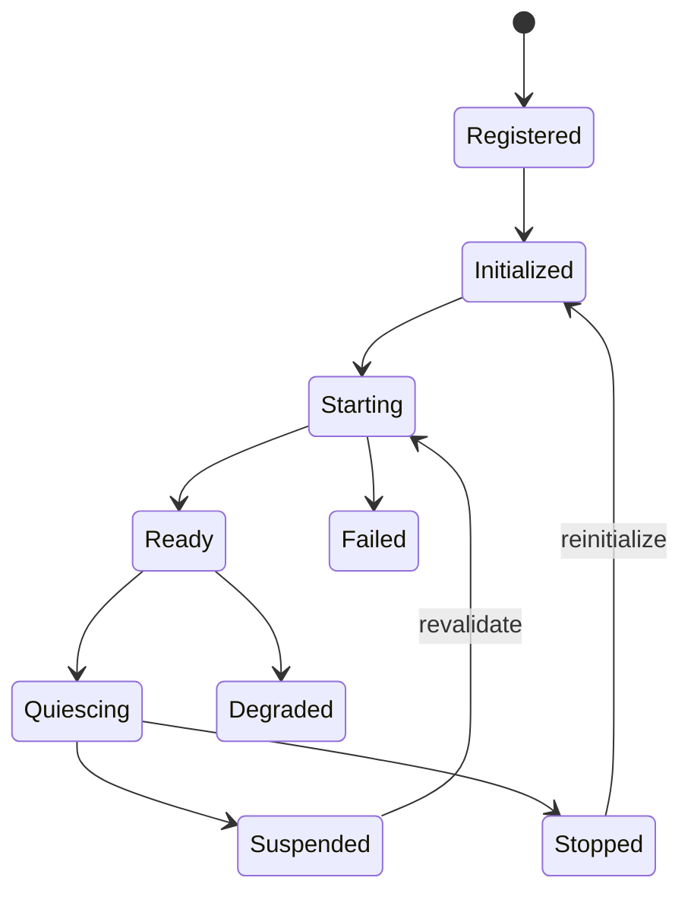
```mermaid
stateDiagram-v2
  [*] --> Registered
  Registered --> Initialized
  Initialized --> Starting
  Starting --> Ready
  Starting --> Failed
  Ready --> Quiescing
  Ready --> Degraded
  Quiescing --> Suspended
  Quiescing --> Stopped
  Suspended --> Starting: revalidate
  Stopped --> Initialized: reinitialize
```

## D10 — Intent versus observed outcome

[Editable Mermaid source](D10.mmd)

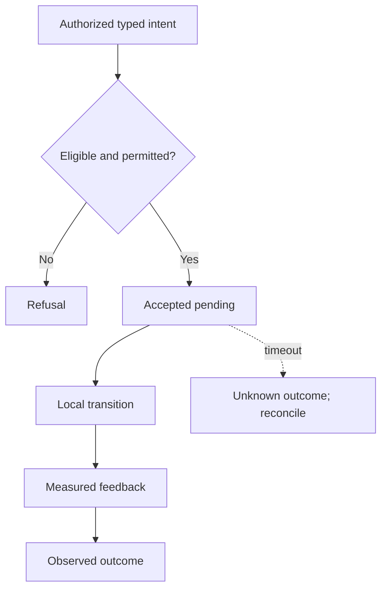
```mermaid
flowchart TD
  I[Authorized typed intent] --> A{Eligible and permitted?}
  A -->|No| R[Refusal]
  A -->|Yes| P[Accepted pending]
  P --> L[Local transition]
  L --> F[Measured feedback]
  F --> O[Observed outcome]
  P -. timeout .-> U[Unknown outcome; reconcile]
```

## D11 — Restart and reconciliation

[Editable Mermaid source](D11.mmd)

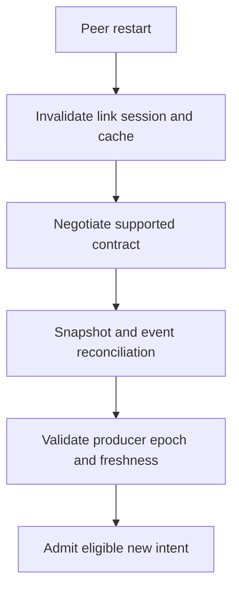
```mermaid
flowchart TD
  R[Peer restart] --> I[Invalidate link session and cache]
  I --> N[Negotiate supported contract]
  N --> S[Snapshot and event reconciliation]
  S --> E[Validate producer epoch and freshness]
  E --> A[Admit eligible new intent]
```

## D12 — Transport providers

[Editable Mermaid source](D12.mmd)

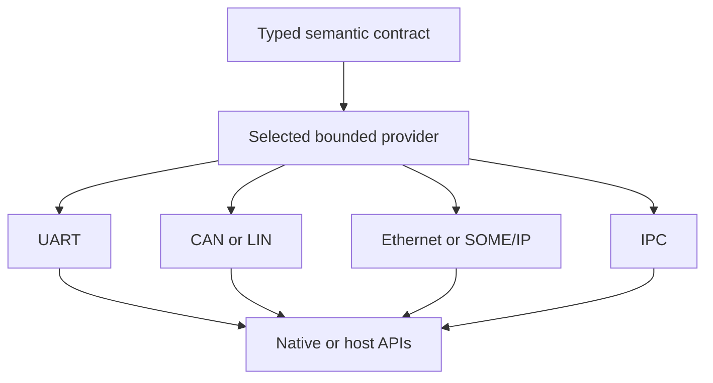
```mermaid
flowchart TD
  C[Typed semantic contract] --> P[Selected bounded provider]
  P --> U[UART]
  P --> V[CAN or LIN]
  P --> E[Ethernet or SOME/IP]
  P --> I[IPC]
  U --> N[Native or host APIs]
  V --> N
  E --> N
  I --> N
```

## D13 — Central compute ownership

[Editable Mermaid source](D13.mmd)

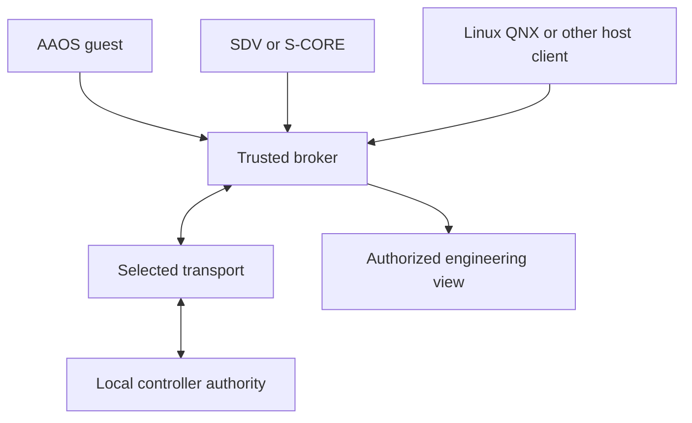
```mermaid
flowchart TD
  A[AAOS guest] --> B[Trusted broker]
  S[SDV or S-CORE] --> B
  L[Linux QNX or other host client] --> B
  B <--> C[Selected transport]
  C <--> R[Local controller authority]
  B --> V[Authorized engineering view]
```

## D14 — VHAL and SDV adapter

[Editable Mermaid source](D14.mmd)

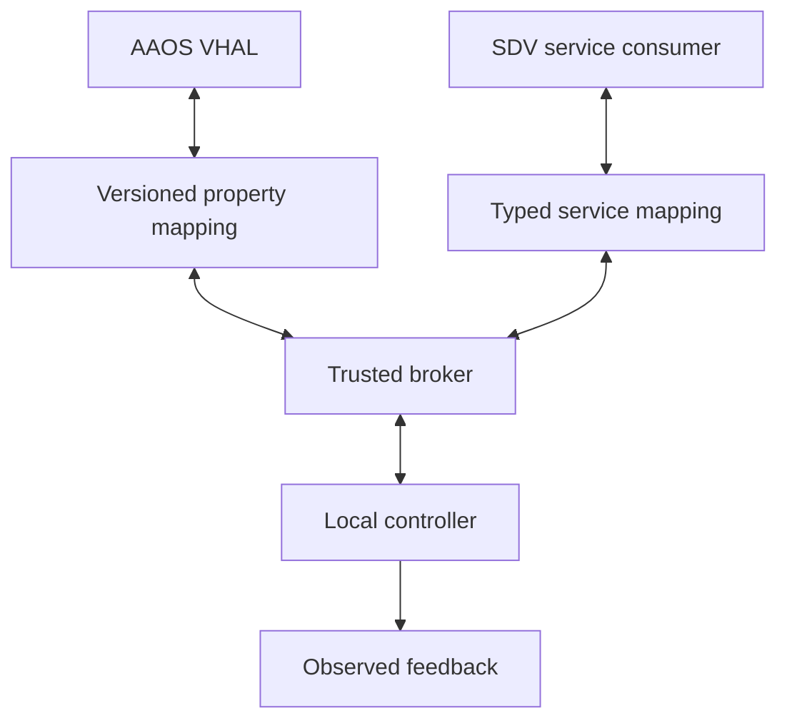
```mermaid
flowchart TD
  A[AAOS VHAL] <--> M[Versioned property mapping]
  S[SDV service consumer] <--> N[Typed service mapping]
  M <--> H[Trusted broker]
  N <--> H
  H <--> C[Local controller]
  C --> O[Observed feedback]
```

## D15 — Coordinated shutdown

[Editable Mermaid source](D15.mmd)

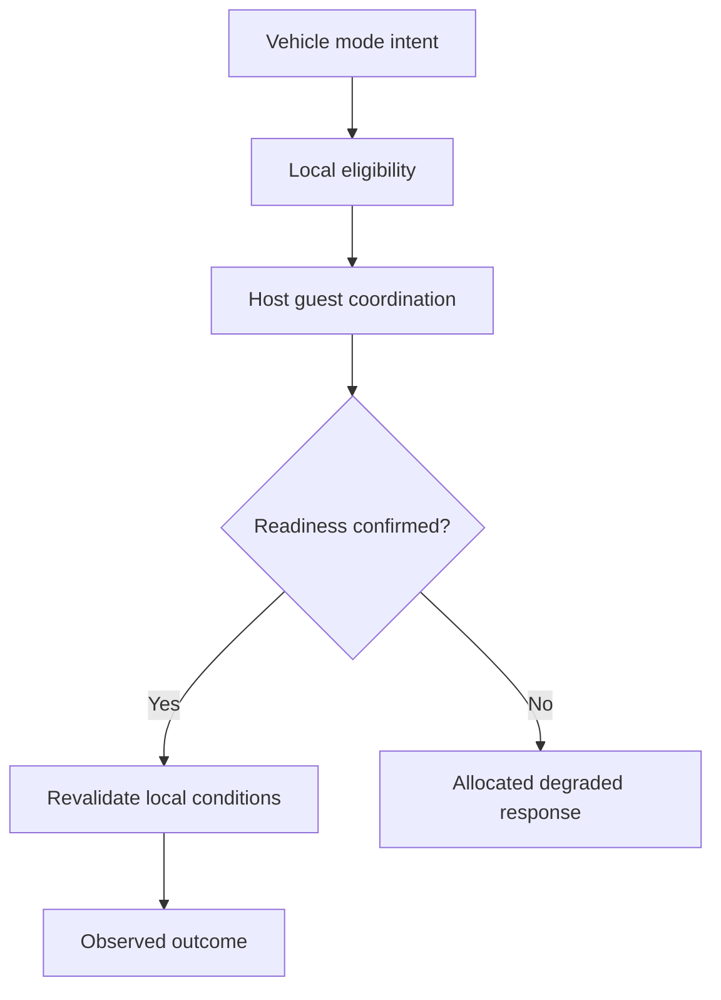
```mermaid
flowchart TD
  V[Vehicle mode intent] --> C[Local eligibility]
  C --> H[Host guest coordination]
  H --> R{Readiness confirmed?}
  R -->|Yes| P[Revalidate local conditions]
  R -->|No| D[Allocated degraded response]
  P --> O[Observed outcome]
```

## D16 — Safety assurance

[Editable Mermaid source](D16.mmd)

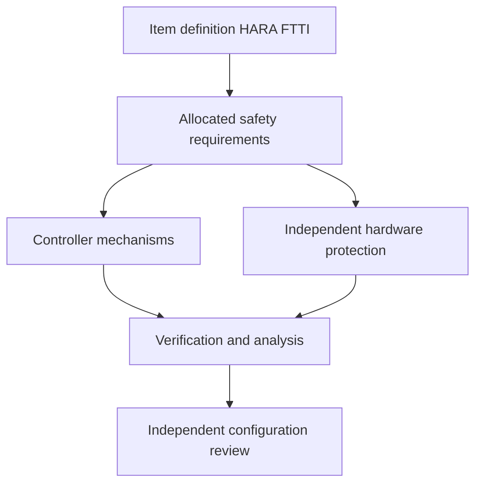
```mermaid
flowchart TD
  I[Item definition HARA FTTI] --> A[Allocated safety requirements]
  A --> C[Controller mechanisms]
  A --> P[Independent hardware protection]
  C --> V[Verification and analysis]
  P --> V
  V --> R[Independent configuration review]
```

## D17 — Authorized visibility and trust

[Editable Mermaid source](D17.mmd)

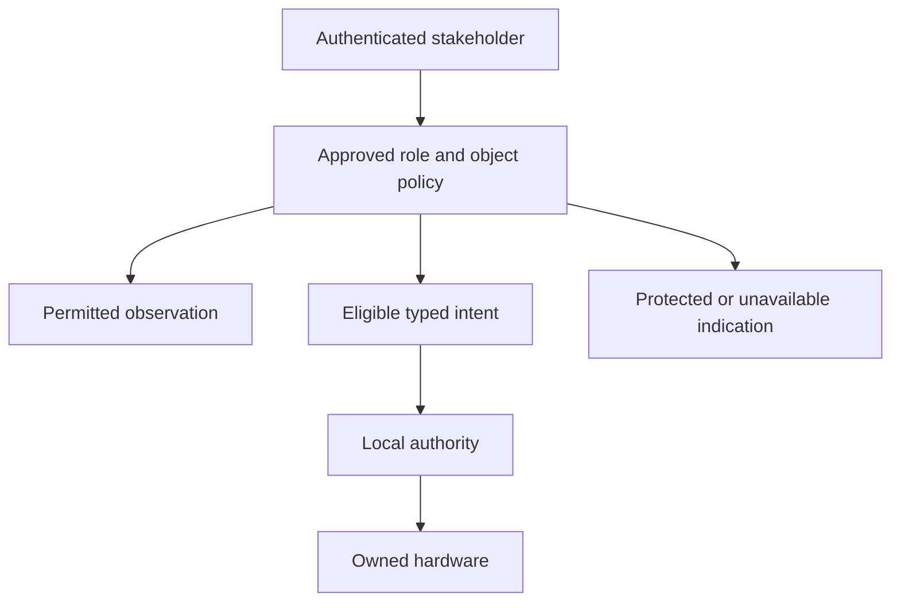
```mermaid
flowchart TD
  U[Authenticated stakeholder] --> P[Approved role and object policy]
  P --> O[Permitted observation]
  P --> I[Eligible typed intent]
  I --> L[Local authority]
  P --> X[Protected or unavailable indication]
  L --> H[Owned hardware]
```

## D18 — Deployment activation and recovery

[Editable Mermaid source](D18.mmd)

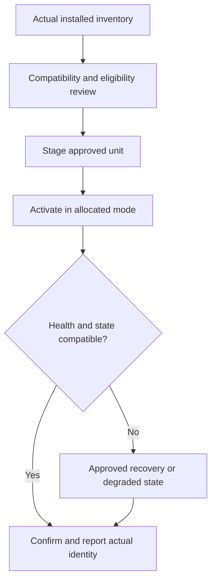
```mermaid
flowchart TD
  I[Actual installed inventory] --> C[Compatibility and eligibility review]
  C --> S[Stage approved unit]
  S --> A[Activate in allocated mode]
  A --> H{Health and state compatible?}
  H -->|Yes| F[Confirm and report actual identity]
  H -->|No| R[Approved recovery or degraded state]
  R --> F
```

## D19 — Evidence progression

[Editable Mermaid source](D19.mmd)

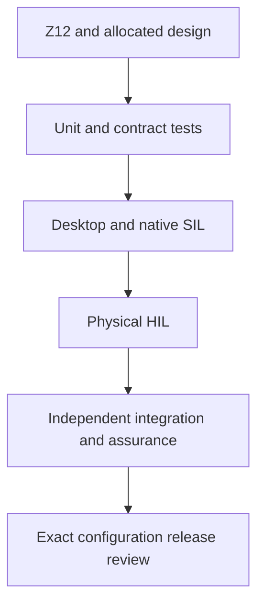
```mermaid
flowchart TD
  R[Z12 and allocated design] --> U[Unit and contract tests]
  U --> S[Desktop and native SIL]
  S --> H[Physical HIL]
  H --> V[Independent integration and assurance]
  V --> E[Exact configuration release review]
```

## D20 — Supplier ecosystem

[Editable Mermaid source](D20.mmd)

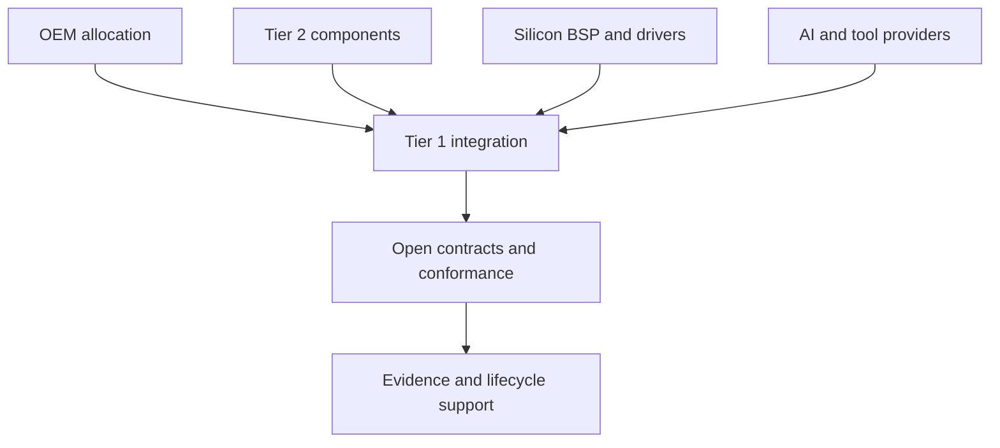
```mermaid
flowchart TD
  O[OEM allocation] --> T[Tier 1 integration]
  C[Tier 2 components] --> T
  S[Silicon BSP and drivers] --> T
  A[AI and tool providers] --> T
  T --> P[Open contracts and conformance]
  P --> E[Evidence and lifecycle support]
```

## D21 — Typed request sequence

[Editable Mermaid source](D21.mmd)

```mermaid
sequenceDiagram
  participant A as Authorized client
  participant B as Trusted broker
  participant C as ZARC local owner
  participant F as Benign feedback
  A->>B: Typed intent
  B->>C: Scoped request
  alt Eligible
    C-->>B: Accepted pending
    C->>F: Allocated local transition
    F-->>C: Measured result
    C-->>B: Observed outcome
    B-->>A: Outcome and quality
  else Refused
    C-->>B: Refusal
    B-->>A: Refusal
  end
```

## D22 — Guest coordination sequence

[Editable Mermaid source](D22.mmd)

```mermaid
sequenceDiagram
  participant V as Vehicle authority
  participant R as Controller
  participant H as Host broker
  participant G as Guest
  V->>R: Desired mode
  R->>H: Bounded coordination
  H->>G: Request readiness
  alt Ready
    G-->>H: Observed readiness
    H-->>R: Aggregate readiness
    R-->>V: Revalidated local outcome
  else Timeout
    H-->>R: Unavailable
    R-->>V: Allocated degraded result
  end
```

## D23 — Micro-components and deployment units

[Editable Mermaid source](D23.mmd)

```mermaid
flowchart TD
  A[Versioned component A] --> C[Static composition]
  B[Versioned component B] --> C
  P[Optional provider] --> C
  C --> U[Admitted deployment unit]
  U --> F[Whole image or supported multi-image/module]
  C --> G[System graph and conformance]
```

## D24 — Five-state identity reconciliation

[Editable Mermaid source](D24.mmd)

```mermaid
flowchart LR
  D[Intended] --> C[Configured]
  C --> B[Built]
  B --> I[Deployed]
  I --> O[Observed]
  D --> R[Reconciliation]
  C --> R
  B --> R
  I --> R
  O --> R
  R --> E[Match or explicit discrepancy]
```

## D25 — System visibility plane

[Editable Mermaid source](D25.mmd)

```mermaid
flowchart TD
  L[Local control] -. bounded snapshot .-> O[Observation catalog]
  H[Health and diagnostic records] --> O
  I[Artifact and model inventory] --> O
  G[System graph] --> O
  O --> P[Authorized view and provenance]
  P --> E[Engineer or service consumer]
```

## D26 — AI and coordinated lifecycle

[Editable Mermaid source](D26.mmd)

```mermaid
flowchart TD
  M[Approved model and preprocessing] --> A[Bounded advisory provider]
  A -. typed advice .-> P[Local deterministic policy]
  P --> I[Owned I/O]
  F[External fleet coordinator] --> U[Eligible deployment-unit policy]
  U --> M
  U --> O[Actual version and recovery report]
```
